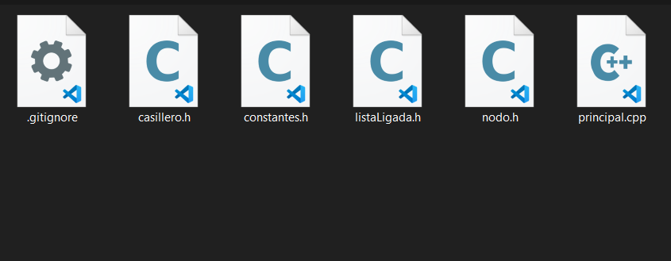

## 75.41 / 95.15 Algoritmos y Programación II Curso P. Calvo 
# Hackers-Panas-TP2

Repositorio hecho para el desarrollo grupal del Trabajo Práctico 2 - "4 EN LÍNEA v1.0"

<hr/>

## **Tabla de Contenidos**

* [Lista de Colaboradores](#colaboradores)
* [Convenciones Generales](#convenciones-para-contribuir)
* [Cómo contrubuir al repositorio](#cómo-contribuir-al-repositorio)

<br/>
<hr/>

### Colaboradores

* [Franco Lighterman Reismann](https://github.com/NLGS2907)
* [Guillermina Hoffmann](https://github.com/guillehoff)
* [Joaquín Gandolfo](https://github.com/JGandolfoM)
* [Nico Gareca](https://github.com/nicogareca)
* ~~[Saul Gerardo](https://github.com/saulGerardoL)~~ [04/06/2021: Dejó la materia]

<br/>

## Convenciones para contribuir

Las mismas son más una norma general que una regla estricta que se debe acatar oblgiatoriamente, sin embargo se recomienda seguirlas para entender mejor este código desarrollado grupalmente.

* **Variables y Funciones:** Los nombres de variables (y atributos de clases), así como las de funciones (y por extensión métodos) e instancias de objetos
  se declaran con *camelCase*, es decir empezando la palabra con una letra minúscula, y no se utilizan espacios si no que la siguiente palabra (fuese el nombre
  de la variable una frase compuesta de varias palabras) es agregada tal cual pero con la inicial en mayúscula. ***Ejemplo:***
  ```c++
  int estoEsUnaVariable;
  ```

* **Clases:** Los nombres para las clases y TDAs hechos siguen las mismas guías que para las variables y funciones, con *camelCase*, sólo que esta vez la primera
  palabra **también** debe tener la inicial en mayúscula. ***Ejemplo:***
  ```c++
  class EstoEsUnaClase {}
  ```

* **Constantes:** Los nombres de constantes, es decir valores que no cambian en toda la ejecución del programa, deberían declararse con *snake_case*; con todas
  las palabras escritas con mayúscula. ***Ejemplo:***
  ```c++
  int const ESTO_ES_UNA_CONSTANTE
  #define ESTO_TAMBIEN // <- Esto en realidad no guarda ninguna variable en memoria.
  ```

* **Archivos:** Los archivos deberían seguir la misma guía que las variables y funciones, con *camelCase*:
  

* **Documentación:** Todas las funciones, métodos u otro bloque/línea de código que requiera una documentación pertinente es recomendada seguir la plantilla siguiente:
  ```c++
  /*                                                  <- Un salto de línea al empezar y terminar el comentario.
  __________________________________________________  <- estos son exactamente cincuenta (50) barras bajas ('_')
  PRE: (pre-condiciones)                              <- PRE es escrito en mayúscula, seguido de dos puntos, un espacio, y ahí las condiciones.
  -                                                   <- Para separar, un único guión se escribe en esta línea.
  POS: (pos-condiciones)                              <- POS es escrito en mayúscula, seguido de dos puntos, un espacio, y ahí las condiciones.
  __________________________________________________

  (Descripción adicional)                             <- Se describe brevemente lo que hace la función, y/o se hacen aclaraciones que no entrarían arriba.
  */
  int funcionCualquiera;
  ```
  Cabe aclarar, que todos los detalles están sujetos al nivel de indentación (sangría) que tenga ese bloque de código en concreto dentro del cuerpo del archivo. Es una
  aclaración mínima, irrelevante casi, pero convendría tener cuidado que todos las líneas de la plantilla mostrada, de ser usadas, estén indentadas al mismo nivel.
  Es decir que
  ```c++
  /* <- éste está una línea adelante
   __________________________________________________
   PRE: (pre-condiciones)
   -
   POS: (pos-condiciones)
   __________________________________________________
  
   (Descripción adicional)
   */
  int funcionCualquiera;
  ```
  no sería una versión válida en estos términos.
  <br/><br/>
  También, es preferible que en la sección de PRE y POS condiciones, de haber un texto que superase una línea (las líneas no tienen una longitud definida pero debería
  tratarse de que las mismas queden más o menos justificadas), la sangría que tienen las nuevas líneas obedecen al punto donde empiezan a escribirse las pre-condiciones
  o las pos-condiciones; y no donde empiezan las palabras PRE/POS. Es decir, se sigue lo siguiente:
  ```c++
  /*
  __________________________________________________
  PRE: Esta es una pre-condición MAL
  escrita en multilínea.                              <- Esto está mal indentado.
  -
  POS: Esta, en cambio, es una pos-condición
       BIEN escrita en multilínea.                    <- Esto está bien indentado.
  __________________________________________________

  (Descripción adicional) 
  */
  int funcionCualquiera;
  ```

<br/>

## ¿Cómo contribuir al repositorio?

Toda forma de contribución es detallada en el archivo *CONTRIBUTING.md* de este repositorio, que se encuentra [aquí](CONTRIBUTING.md).
