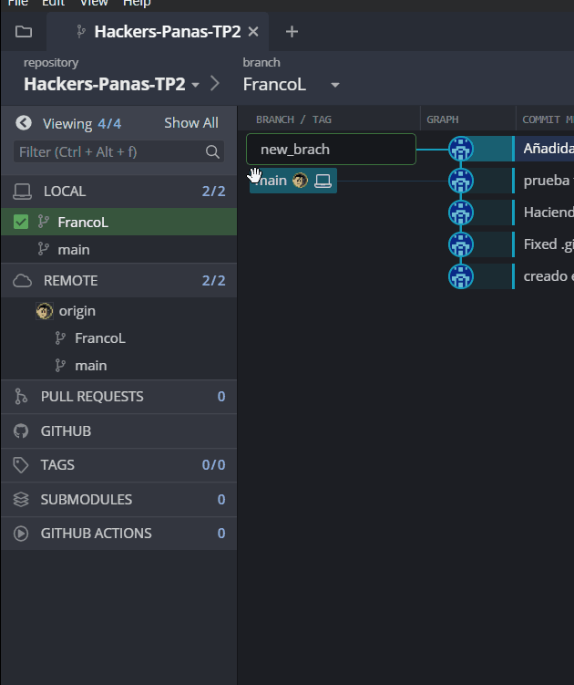

## 75.41 / 95.15 Algoritmos y Programación II Curso P. Calvo 
# Hackers-Panas-TP2

Repositorio hecho para el desarrollo grupal del Trabajo Práctico 2 - "4 EN LÍNEA v1.0"

### Colaboradores:

* [Franco Lighterman Reismann](https://github.com/NLGS2907)
* [Guillermina Hoff](https://github.com/guillehoff)
* [Joaquín Gandolfo](https://github.com/JGandolfoM)
* [Nico Gareca](https://github.com/nicogareca)
* [Saul Gerardo](https://github.com/saulGerardoL)

### Cómo contribuir al repositorio:

La manera en que **Hackers-Panas-TP2** opera es mediante los llamados *pull requests*, para los cuales el codigo fuente se desarrolla de la siguiente manera:

1. En caso de usar un software que gestione un clon 'local' del repositorio (como **GitHub Desktop** o **GitKraken**), crear una rama en el repositorio local
para el uso personal del colaborador. Preferiblemente del formato ***[NombreInicialApellido]***. Así, "*Franco Lighterman*" sería **"FrancoL"**.

  

2. Todos los *commits* y *pushs* al repositorio remoto de ese colaborador deberían ser hechas a su respectiva rama, la cual no está protegida por ninguna regla,
por lo que se confía en no haber modificaciones hechas sin permiso debido por otro usuario que no sea el colaborador asignado a esa rama.

  
  

3. Cuando ese colaborador quiere contribuir con un cambio o retoque al código fuente de la rama principal *main*, o contribuir al proyecto con un algoritmo que hizo,
debe abrir un *pull request*, el cual dos (2) otros colaboradores más deben aprobar. De ser así, dicho cambio se une a la rama *main*.

  
  

(**NOTA:** Salvo que se pida pasar archivos específicos, hay riesgo de que se trate de pullear una rama entera a la principal y sobreescribirla, por lo que para reducir
dicho riesgo, cada vez que se apruebe un cambio en el principal, cada rama debería pullear esos cambios para que el mismo se refleje en todas las ramas).

*Todas las normas comunes explicadas arriba están sujetas a posterior revisión y/o modificación por parte de los demás colaboradores.*
